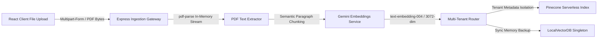
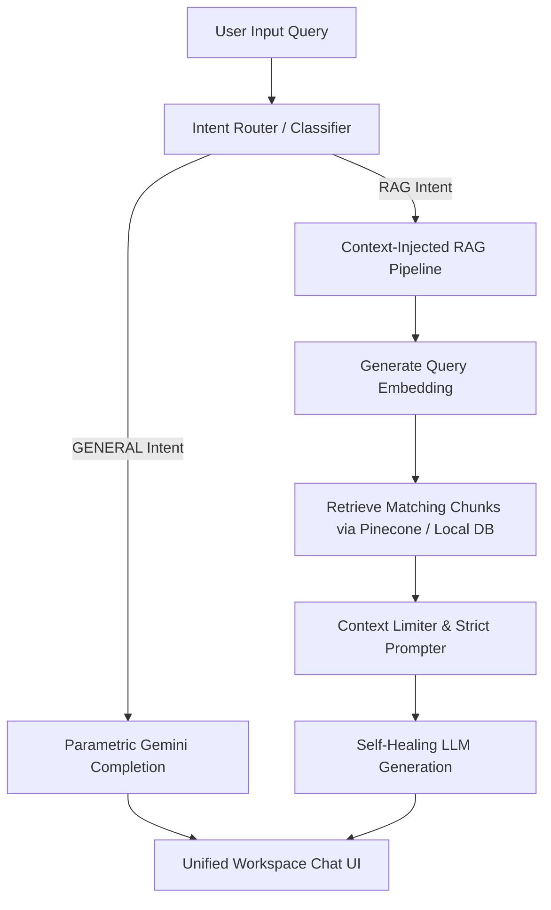

# 🚀 OmniSearch — Multi-Tenant Hybrid RAG & Conversational SaaS Workspace

OmniSearch is a production-grade, highly secure **Multi-Tenant Hybrid RAG (Retrieval-Augmented Generation) & Conversational SaaS Workspace**. Built to meet the scaling demands of modern enterprises, it seamlessly connects a responsive React-Vite dashboard with a secure Node.js/Express API. It implements rigorous multi-tenant data isolation, secure vector searches via Pinecone Serverless with a local zero-dependency database fallback, real-time PDF byte streaming parsing, and a self-healing LLM fallback route utilizing Google's Gemini models.

---

## 🏗️ Architectural Overview

OmniSearch is designed with a decoupled frontend-backend architecture structured to guarantee secure data ingestion and low-latency querying.

### 1. Ingestion Pipeline


* **Ingestion Steps**:
  1. Users drag-and-drop a PDF on the React Dashboard.
  2. The raw PDF bytes are streamed to `/api/documents/upload` via `multer`.
  3. `pdf-parse` extracts the textual data from the file buffer without saving intermediate files onto disk.
  4. The extracted document is broken down into semantic chunks with a configurable overlapping window.
  5. The chunks are processed by Google's `text-embedding-004` (falling back to `gemini-embedding-001`) to generate 3072-dimensional vector representations.
  6. The vectors are upserted into the **Pinecone Serverless Index** (or a local in-memory fallback database) with metadata fields like `user_id` to enforce strict isolation.

### 2. Query Engine & Intent Routing


* **Intent Routing Steps**:
  1. The user's query is intercepted by the **Intent Router** classifier.
  2. The router runs a fast classification prompt through Gemini to determine if the query has a **GENERAL** (conversational chit-chat, greetings, coding, math) or **RAG** (inquiring about company policies, benefits, travel, expense) intent.
  3. If **GENERAL**, the system routes to a parametric baseline completion.
  4. If **RAG**, the system executes a semantic search across Pinecone / Local Vector DB, filters matching items by the active user's ID, injects the retrieved context, and applies strict containment rules (*"I am sorry, but I do not have access to that information..."* if context is insufficient).

---

## ✨ Core Features Highlight

* **💬 Multi-Chat Thread Management**
  An interactive, persistence-backed session navigation tree allows users to create, switch, and delete chat conversations. Chats and message logs are saved and loaded dynamically from the database.
* **🛡️ Multi-Tenant Database Isolation**
  Database tables (`chats`, `messages`, `documents`) are isolated utilizing strict foreign key constraints linked to user ids. User-uploaded files are only accessible to their respective tenants.
* **🔒 Data Privacy Vector Filters**
  During vector indexing and lookup, queries specify the user metadata filter (`user_id` must match `currentUserId` OR public `system`). This keeps proprietary document context strictly segregated across tenants.
* **📄 True PDF Byte Streaming & Parsing**
  Implements real-time PDF parsing direct from binary buffers using a custom class implementation of `pdf-parse`. Files are parsed in-memory, avoiding local disk caching and enhancing privacy compliance.
* **🔄 Self-Healing LLM Fallback Routing**
  Resilient model connection chain guarantees uptime. The service automatically rotates through model options (`gemini-2.5-flash` ➡️ `gemini-1.5-flash` ➡️ `gemini-3.5-flash`) if quota limits or HTTP timeouts are reached.

---

## 🛠️ Setup & Installation Instructions

Follow these instructions to run the full-stack workspace locally.

### 📋 Prerequisites
- **Node.js** (v18 or higher)
- **npm** (v9 or higher)
- **PostgreSQL Database** (running locally or hosted)

### 1. Set Up the Local PostgreSQL Database
1. Launch your local PostgreSQL instance (e.g., pgAdmin, Docker, or native service).
2. Create a new database named `postgres` (or modify your credentials in the environment setup).
3. The database tables (`users`, `chats`, `messages`, `documents`, and `vectors`) will be automatically created and verified by the backend server on startup.

### 2. Configure the Environment Variables
Create a file named `.env` in the `/backend` folder:
```bash
# e.g., e:/omni-search/backend/.env
PORT=5000
JWT_SECRET=super_secret_company_rag_jwt_key_2026

# AI & Vector Credentials
GEMINI_API_KEY=your_gemini_api_key_here
PINECONE_API_KEY=your_pinecone_api_key_here

# PostgreSQL Database Credentials
PGHOST=localhost
PGPORT=5432
PGUSER=postgres
PGPASSWORD=your_postgres_password_here
PGDATABASE=postgres
```
*Note: If `PINECONE_API_KEY` is left blank, the system automatically falls back to utilizing the high-performance local vector database singleton.*

### 3. Install Workspace Dependencies
Execute the following command in the **root** folder:
```bash
# Installs concurrently in the root and links the sub-folders
npm install
```

### 4. Launch the Workspace
To start both the Express backend API server and Vite frontend dev server concurrently, run:
```bash
npm run dev
```
Once launched:
- **Frontend App**: [http://localhost:5173](http://localhost:5173) (Locks reliably with `strictPort`)
- **Backend API Gateway**: [http://localhost:5000](http://localhost:5000) (Strict CORS restricted to port 5173)

---

## 🧪 Automated Testing

Verify the security parameters, vector search performance, and API route protection policies with our test suite.

Run these scripts from the `/backend` directory:
* **Core RAG Logic Validation**:
  ```bash
  npm run --prefix backend test-rag
  ```
* **PDF Parse & Database Ingestion Testing**:
  ```bash
  npm run --prefix backend test-pdf-db
  ```
* **End-to-End API Routes Integration Verification**:
  ```bash
  npm run --prefix backend test-api
  ```