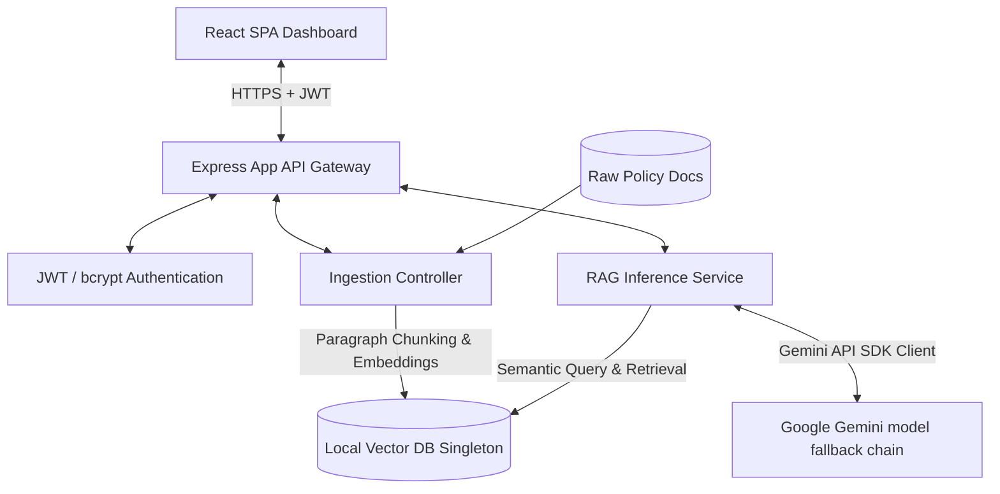

# 🚀 Omni-Search: Smart Corporate RAG Bot

[](https://nodejs.org/)
[](https://react.dev/)
[](https://tailwindcss.com/)
[](https://ai.google.dev/)
[](https://github.com/mallikarjun-codes/omni-search)

A production-grade, highly secure **Retrieval-Augmented Generation (RAG)** application. It provides authenticated corporate employees with accurate, context-shielded answers derived strictly from official company policies (e.g., HR, IT, and travel guidelines) via the Google Gemini API.

---

## 🏗️ High-Level Architecture

Omni-Search bridges a responsive React frontend with a secure Node.js backend using a custom, zero-dependency local vector database.



### 💻 Stack Breakdown
* **Frontend**: React (Vite-powered Single Page Application) styled with custom Tailwind CSS utilizing a premium dark glassmorphism aesthetic.
* **Backend**: Node.js & Express RESTful API with CORS policies and pre-flight handling explicitly configured.
* **Authentication**: JSON Web Tokens (JWT) for route protection and `bcryptjs` for secure password hashing.
* **Vector Store**: A lightweight, zero-dependency `LocalVectorDB` class implementing paragraph-level chunking, cosine similarity scoring, and embedded-vector retrieval.
* **AI & Embeddings**: Official `@google/genai` SDK orchestrating both embedding generation (`gemini-embedding-001` or `text-embedding-004`) and context-restricted prompt response generation.

---

## ✨ Core Features

* **🛡️ Hardened JWT Protection & CORS Shielding**
  All chat, upload, and querying endpoints are strictly guarded by JWT authorization middleware. CORS policies restrict connections exclusively to approved origins with automated pre-flight caching.
* **⚡ Zero-Dependency Local Vector Storage**
  No external database is required. Features a local in-memory vector store running cosine similarity algorithms on query vectors against chunked corporate documents.
* **🔄 Resilient Fallback Gemini Model Network**
  Robust connection management featuring an automated model fallback chain (`gemini-1.5-flash` ➡️ `gemini-2.5-flash` ➡️ `gemini-3.5-flash`) to guarantee request fulfillment even during model-specific high demand, quotas, or version transitions.
* **📜 Smart Context-Limiting Constraints**
  Prompts are structurally bound to answer questions *only* if matching context chunks are available. If information cannot be confidently retrieved, the LLM safely responds with a standardized fallback message: *"I am sorry, but I do not have access to that information in the official company documents."*

---

## 🚀 Quick Start Guide

### 📋 Prerequisites
Make sure you have [Node.js](https://nodejs.org/) (v18+) and `npm` installed.

### 1. Clone the Repository
```bash
git clone https://github.com/mallikarjun-codes/omni-search.git
cd omni-search
```

### 2. Configure the Backend Environment
Create a `.env` file under the `/backend` directory:
```bash
# e.g., e:/omni-search/backend/.env
PORT=5000
JWT_SECRET=super_secret_company_rag_jwt_key_2026
GEMINI_API_KEY=your_actual_gemini_api_key_here
```

### 3. Install Dependencies
Install all orchestrator and service packages from the root workspace folder:
```bash
# Installs root-level dependencies (concurrently)
npm install

# Installs backend-specific dependencies
npm install --prefix backend

# Installs frontend-specific dependencies
npm install --prefix frontend
```

### 4. Run the Application
Start both the Express backend and React frontend concurrently with a single command from the root directory:
```bash
npm run dev
```

* Backend will spin up at **[http://localhost:5000](http://localhost:5000)**.
* Frontend will open at **[http://localhost:5173](http://localhost:5173)**.

---

## 🧪 Running Verification Tests

Omni-Search contains a comprehensive local validation and integration test suite to run inside the `/backend` directory:

* **Vector Database & Embeddings Pipeline**:
  ```bash
  npm run --prefix backend test-vector
  ```
* **Core RAG Inference Constraints**:
  ```bash
  npm run --prefix backend test-rag
  ```
* **End-to-End Server REST API Integration**:
  ```bash
  npm run --prefix backend test-api
  ```